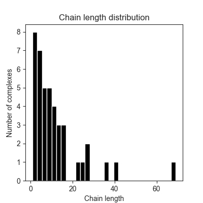

Simple chain polymerization model
====================================

**Author:** Yarden Katz

Simple model where ``C`` agents can polymerize into chains ([simple_chain.ka](../models/simple_chain.ka)). The main rule is:

```
'form_chain' C(x,y[.]),C(x[.],y[.]) <-> C(x,y[1]),C(x[1],y[.]) @ 'chain_bind_k', 'chain_unbind_k'
```

This rule states that ``C`` agents can polymerize one at a time; meaning a free ``C`` can be added to the end of an existing chain (sometimes referred to as "chain-growth polymerization"). 

If we run this model for a while and obtain a snapshot from Kappa, we get the following distribution of chain lengths:




